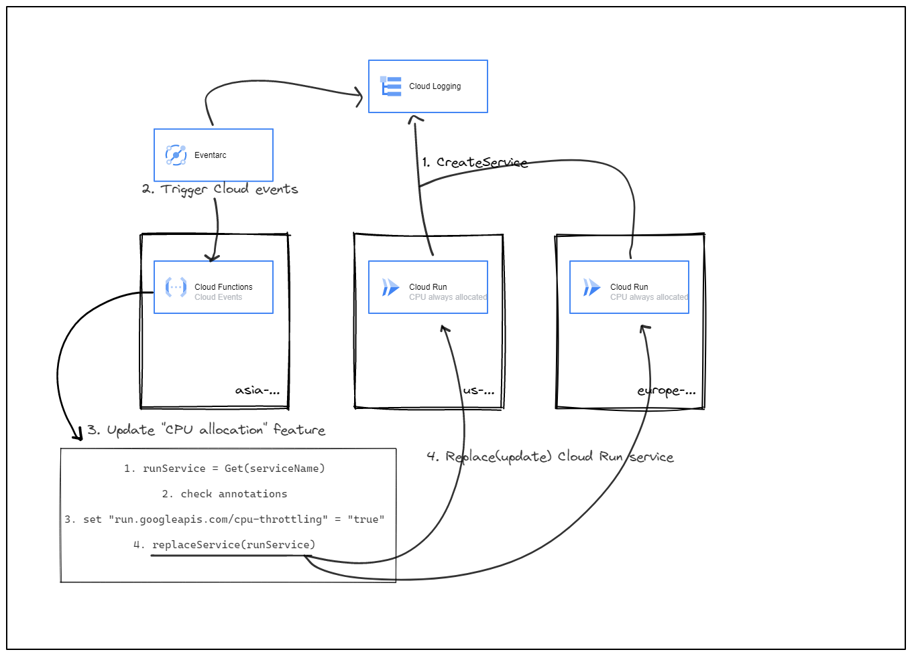
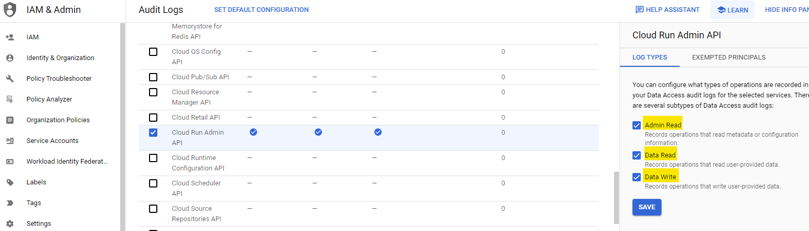
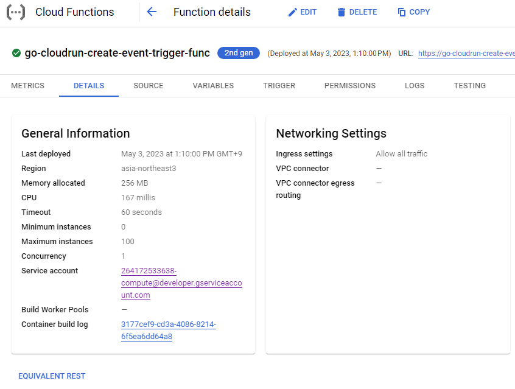
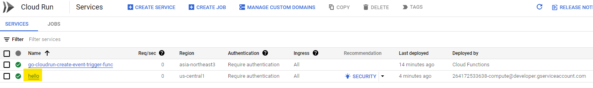
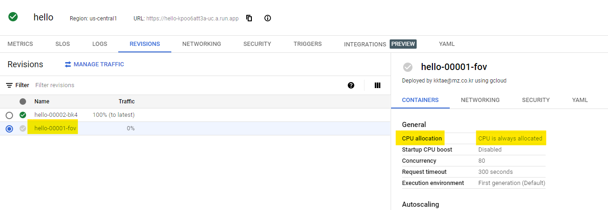
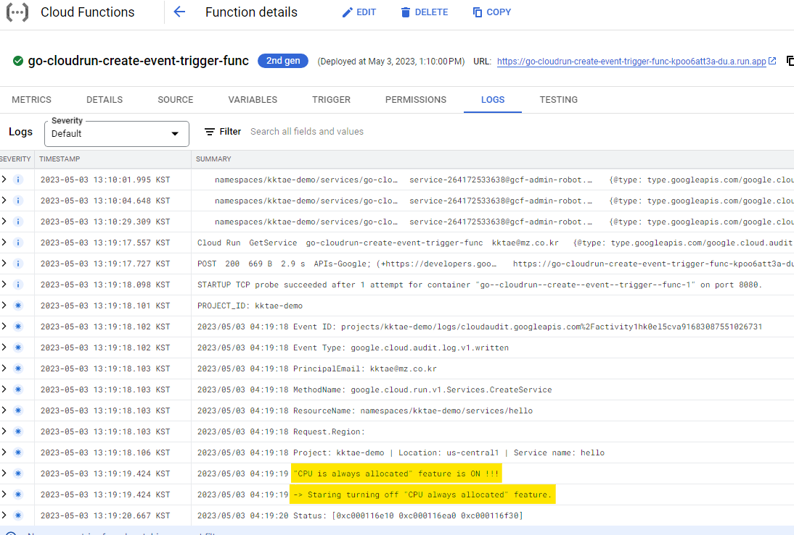
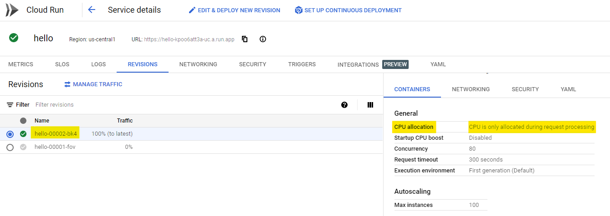

# Cloud Run feature control using Cloud Function

- [Cloud Run feature control using Cloud Function](#cloud-run-feature-control-using-cloud-function)
  - [Overview](#overview)
  - [Reference note](#reference-note)
    - [Cloud Functions(2세대)에서 지원되는 트리거](#cloud-functions2세대에서-지원되는-트리거)
    - [supported events list](#supported-events-list)
  - [Before you begin](#before-you-begin)
    - [Enable Audit Logs](#enable-audit-logs)
    - [Enable APIs](#enable-apis)
  - [Prerequisites](#prerequisites)
  - [Preparing the application](#preparing-the-application)
  - [Deploying the function](#deploying-the-function)
    - [gcloud-cli command](#gcloud-cli-command)
    - [GCP console result](#gcp-console-result)
  - [Deploying demo Cloud Run](#deploying-demo-cloud-run)
    - [Run demo Cloud Run](#run-demo-cloud-run)
  - [Delete resouces](#delete-resouces)
  - [Limitations](#limitations)

## Overview



1. When creating Cloud Run, logged CreateService method.
2. Cloud Function triggering in Cloud Events.
3. If the `CPU is always allocated` feature is **true**, update to **false**.
4. Update Cloud Run via `replcaeService` function.

## Reference note

### [Cloud Functions(2세대)에서 지원되는 트리거](https://cloud.google.com/functions/docs/calling#2nd-gen-triggers)

Cloud Functions(2세대)에서 지원하는 트리거 유형은 다음과 같습니다.

- HTTP 트리거
- 이벤트 트리거:
  - Pub/Sub 트리거
  - Cloud Storage 트리거
  - **일반화된 Eventarc 트리거**
    - **Cloud 감사 로그**를 통해 90개 이상의 이벤트 소스를 포함하여 Eventarc에서 지원되는 모든 이벤트 유형 지원

Cloud Functions(2세대)의 모든 이벤트 기반 함수는 이벤트 전송에 Eventarc를 사용합니다.  
Cloud Functions(2세대)에서 Pub/Sub 트리거 및 Cloud Storage 트리거는 특정 유형의 Eventarc 트리거로 구현됩니다.

### [supported events list](https://cloud.google.com/eventarc/docs/reference/supported-events#cloud-run)

## Before you begin

### [Enable Audit Logs](https://console.cloud.google.com/iam-admin/audit?_ga=2.171696032.1890056829.1682990289-1759029109.1641476240)



### [Enable APIs](https://console.cloud.google.com/flows/enableapi?apiid=compute.googleapis.com%2Ccloudbuild.googleapis.com%2Cartifactregistry.googleapis.com%2Ceventarc.googleapis.com%2Ceventarcpublishing.googleapis.com%2Clogging.googleapis.com%2Cpubsub.googleapis.com%2Ccloudfunctions.googleapis.com&%3Bredirect=https%3A%2F%2Fcloud.google.com%2Ffunctions%2Ftutorials%2Fcloud-audit-logs&hl=ko&_ga=2.9624950.219758434.1682298192-1759029109.1641476240&_gac=1.222353769.1678857054.Cj0KCQjwtsCgBhDEARIsAE7RYh3McYeqwbPqleMhTFMZ8ywZg8RmQPBBPLnpNSQgpeitCwOdpCj_q74aAgndEALw_wcB)

- Compute Engine API
- Cloud Build API
- Artifact Registry API
- Eventarc API
- Eventarc Publishing API
- Cloud Logging API
- Cloud Pub/Sub API
- Cloud Functions API

## Prerequisites

1. Grant the `eventarc.eventReceiver` role to the project's Compute Engine service account. This service account will be used as the service identity for Cloud Functions:

   ```bash
   PROJECT_ID=$(gcloud config get-value project)
   PROJECT_NUMBER=$(gcloud projects list --filter="project_id:$PROJECT_ID" --format='value(project_number)')

   # Allow default service account(or your service account) token creation
   gcloud projects add-iam-policy-binding $PROJECT_ID \
   --member serviceAccount:$PROJECT_NUMBER-compute@developer.gserviceaccount.com \
   --role roles/eventarc.eventReceiver

   # Allow service account token creation
   gcloud projects add-iam-policy-binding $PROJECT_ID \
   --member serviceAccount:service-$PROJECT_NUMBER@gcp-sa-pubsub.iam.gserviceaccount.com \
   --role roles/iam.serviceAccountTokenCreator
   ```

## Preparing the application

- function.go

  ```go
    // ...
    // 소스 참조 ...
    // ...
  ```

## Deploying the function

### gcloud-cli command

```bash
CLOUDFUNCTION_REGION=asia-northeast3
TRIGGER_LOCATION=global
gcloud functions deploy go-cloudrun-create-event-trigger-func \
--gen2 \
--runtime=go120 \
--region=$CLOUDFUNCTION_REGION \
--source=. \
--entry-point=CloudEventFunc \
--trigger-location=$TRIGGER_LOCATION \
--trigger-event-filters="type=google.cloud.audit.log.v1.written" \
--trigger-event-filters="serviceName=run.googleapis.com" \
--trigger-event-filters="methodName=google.cloud.run.v1.Services.CreateService"
```

### GCP console result



## Deploying demo Cloud Run

### Run demo Cloud Run

1. Create service in Cloud Run with gcloud-cli.

   - this demo container is `us-docker.pkg.dev/cloudrun/container/hello`
   - _`--no-cpu-throttling` feature means `CPU is always allocated`_

   ```bash
   CLOUDRUN_REGION=us-central1
   PROJECT_ID=$(gcloud config get-value project)
   PROJECT_NUMBER=$(gcloud projects list --filter="project_id:$PROJECT_ID" --format='value(project_number)')

   gcloud run deploy hello \
   --image=us-docker.pkg.dev/cloudrun/container/hello \
   --no-allow-unauthenticated \
   --service-account=$PROJECT_NUMBER-compute@developer.gserviceaccount.com \
   --no-cpu-throttling \
   --region=$CLOUDRUN_REGION \
   --project=$PROJECT_ID
   ```

2. Check the deployed demo app.
   
   

3. Check logs the Cloud Function that was deployed earlier.
   

4. Check Cloud Run _revision_ and _CPU allocation_ feature.
   

## Delete resouces

```bash
gcloud run services delete hello --project=$PROJECT_ID --region=$CLOUDRUN_REGION -q

gcloud functions delete go-cloudrun-create-event-trigger-func --region=$REGION -q

gcloud storage rm --recursive gs://gcf-v2-sources-$PROJECT_NUMBER-$CLOUDFUNCTION_REGION/

gcloud storage rm --recursive gs://gcf-v2-uploads-$PROJECT_NUMBER-$CLOUDFUNCTION_REGION/
```

## Limitations

- **This is not a consideration for existing resources.**
  - In this case, refer to `google.cloud.run.v1.Services.ReplaceService` as `Eventarc trigger` in CloudFunction.

<!--
- (Optinal) Local test
````Bash
curl localhost:8080 \
  -X POST \
    -H "Content-Type: application/json" \
    -H "ce-id: 1234567890" \
    -H "ce-specversion: 1.0" \
    -H "ce-type: google.cloud.audit.log.v1.written" \
    -H "ce-time: 2020-08-08T00:11:44.895529672Z" \
    -H "ce-source: //cloudaudit.googleapis.com/projects/kktae-demo/logs/data_access" \
  -d '{
  "protoPayload": {
    "@type": "type.googleapis.com/google.cloud.audit.AuditLog",
    "authenticationInfo": {
      "principalEmail": "kktae@mz.co.kr"
    },
    "requestMetadata": {
      "callerIp": "221.148.114.22",
      "callerSuppliedUserAgent": "Mozilla/5.0 (Windows NT 10.0; Win64; x64) AppleWebKit/537.36 (KHTML, like Gecko) Chrome/112.0.0.0 Safari/537.36,gzip(gfe),gzip(gfe)",
      "requestAttributes": {
        "time": "2023-04-28T02:26:35.122338Z",
        "auth": {}
      },
      "destinationAttributes": {}
    },
    "serviceName": "run.googleapis.com",
    "methodName": "google.cloud.run.v1.Services.CreateService",
    "authorizationInfo": [
      {
        "resource": "namespaces/kktae-demo/services/hello",
        "permission": "run.services.create",
        "granted": true,
        "resourceAttributes": {}
      }
    ],
    "resourceName": "namespaces/kktae-demo/services/hello",
    "request": {
      "@type": "type.googleapis.com/google.cloud.run.v1.CreateServiceRequest",
      "region": "us-central1",
      "service": {
        "apiVersion": "serving.knative.dev/v1",
        "kind": "Service",
        "metadata": {
          "name": "hello",
          "namespace": "kktae-demo",
          "annotations": {
            "run.googleapis.com/ingress": "internal",
            "run.googleapis.com/client-name": "cloud-console",
            "run.googleapis.com/launch-stage": "ALPHA"
          }
        },
        "spec": {
          "template": {
            "metadata": {
              "name": "hello-00001-wol",
              "annotations": {
                "autoscaling.knative.dev/maxScale": "100",
                "run.googleapis.com/cpu-throttling": "false",
                "run.googleapis.com/client-name": "cloud-console"
              }
            },
            "spec": {
              "containerConcurrency": 80,
              "timeoutSeconds": 300,
              "serviceAccountName": "264172533638-compute@developer.gserviceaccount.com"
            }
          }
        }
      },
      "parent": "projects/kktae-demo/regions/us-central1"
    },
    "response": {
      "@type": "type.googleapis.com/google.cloud.run.v1.Service",
      "apiVersion": "serving.knative.dev/v1",
      "kind": "Service",
      "metadata": {
        "name": "hello",
        "namespace": "264172533638",
        "selfLink": "/apis/serving.knative.dev/v1/namespaces/264172533638/services/hello",
        "uid": "4b761ccc-2dcf-48ba-b93f-f92838dbc071",
        "resourceVersion": "AAX6XDO2Dn4",
        "generation": 1,
        "creationTimestamp": "2023-04-28T02:26:35.057790Z",
        "labels": {
          "cloud.googleapis.com/location": "us-central1"
        },
        "annotations": {
          "run.googleapis.com/client-name": "cloud-console",
          "serving.knative.dev/creator": "kktae@mz.co.kr",
          "serving.knative.dev/lastModifier": "kktae@mz.co.kr",
          "run.googleapis.com/operation-id": "e619b93f-a7a5-45b0-a842-deb22a3bc961",
          "run.googleapis.com/ingress": "internal"
        }
      },
      "status": {},
      "spec": {
        "template": {
          "metadata": {
            "name": "hello-00001-wol",
            "annotations": {
              "run.googleapis.com/client-name": "cloud-console",
              "autoscaling.knative.dev/maxScale": "100",
              "run.googleapis.com/cpu-throttling": "false"
            }
          },
          "spec": {
            "containerConcurrency": 80,
            "timeoutSeconds": 300,
            "serviceAccountName": "264172533638-compute@developer.gserviceaccount.com"
          }
        },
        "traffic": [
          {
            "percent": 100,
            "latestRevision": true
          }
        ]
      }
    },
    "resourceLocation": {
      "currentLocations": ["us-central1"]
    }
  },
  "insertId": "11gv063d3op0",
  "resource": {
    "type": "cloud_run_revision",
    "labels": {
      "configuration_name": "",
      "project_id": "kktae-demo",
      "service_name": "hello",
      "location": "us-central1",
      "revision_name": ""
    }
  },
  "timestamp": "2023-04-28T02:26:34.926034Z",
  "severity": "NOTICE",
  "logName": "projects/kktae-demo/logs/cloudaudit.googleapis.com%2Factivity",
  "receiveTimestamp": "2023-04-28T02:26:35.187328057Z"
}'
```
-->

---
